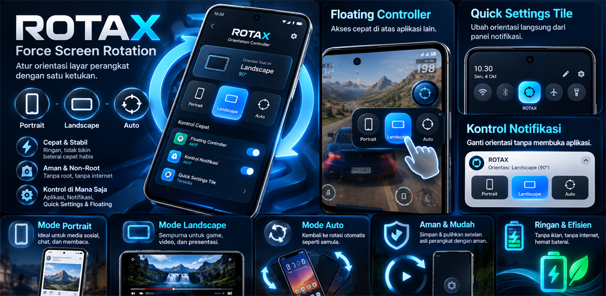
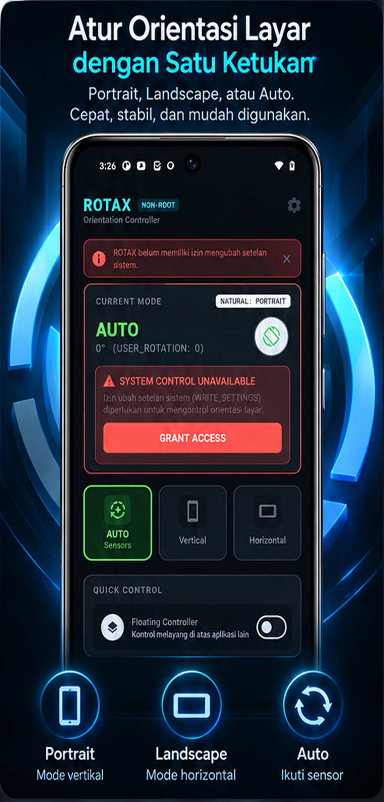
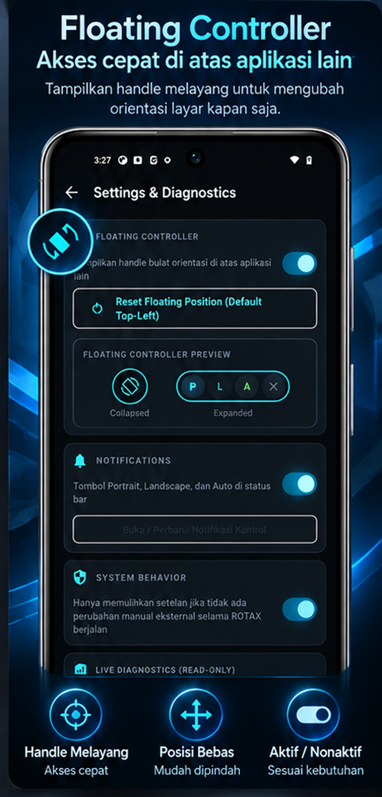
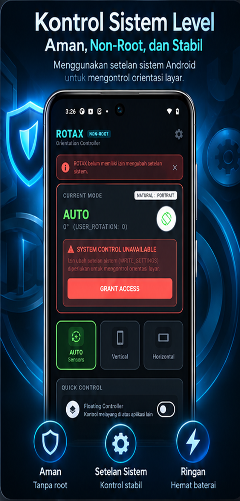
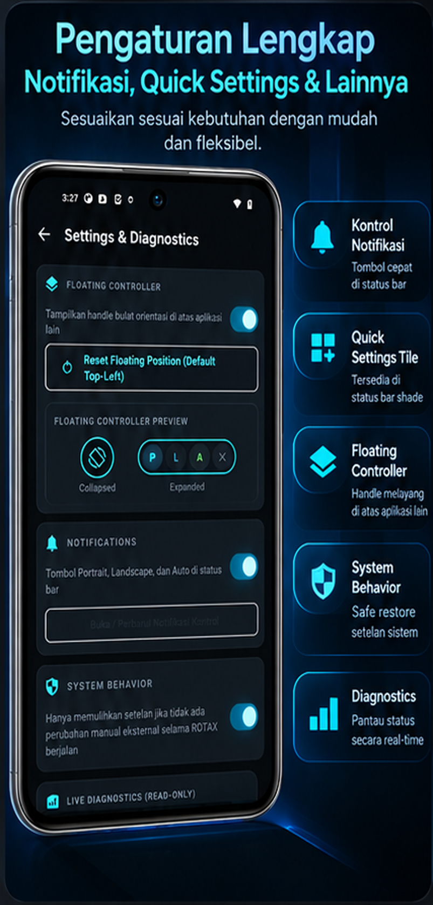

# ROTAX — Universal Android Orientation Controller

<p align="center">
  
</p>

<p align="center">
  <a href="https://opensource.org/licenses/MIT"></a>
  <a href="https://developer.android.com"></a>
  <a href="https://kotlinlang.org"></a>
  <a href="https://developer.android.com/jetpack/compose"></a>
  <a href="#privacy--security-guarantee"></a>
</p>

**ROTAX** (Force Rotation) is a native, non-root Android utility designed to give users system-wide control over display orientation. Built with modern Android architecture, Jetpack Compose Material 3, and Kotlin Coroutines, ROTAX operates 100% offline without ads, analytics, or background battery drain.

---

## 🌐 Official Links & Distribution

- 🚀 **Live Subdomain Landing Page**: [https://forcerotation.idm.web.id/](https://forcerotation.idm.web.id/)
- 📱 **Google Play Store**: [https://play.google.com/store/apps/details?id=id.web.idm.forcerotation](https://play.google.com/store/apps/details?id=id.web.idm.forcerotation)
- 🏢 **Developer & Maintainer**: **PT Ismaya Dewa Mitra** ([https://www.idm.web.id](https://www.idm.web.id))

---

## 📸 App Showcase & Screenshots

<p align="center">
  
  
  
  
</p>

---

## ✨ Feature Highlights

- **Pure Non-Root System Override**: Forces display orientation to **Portrait**, **Landscape**, or **Auto-Rotate** using official Android public system settings APIs (`USER_ROTATION` & `ACCELEROMETER_ROTATION`).
- **Floating Overlay Controller**: Draggable 52dp circular handle overlay that expands into a quick control panel over other applications.
- **Quick Settings Tile**: Instant mode cycling directly from the notification status bar shade (`RotaxTileService`).
- **Persistent Notification Shade**: Ongoing control panel in the notification shade with quick action buttons (`Portrait`, `Landscape`, `Auto`, `Float Off`).
- **Safe Restore (Compare-Before-Restore)**: Smart state comparison before restoring original system settings to prevent overwriting manual changes made outside ROTAX.
- **Natural Orientation Resolution**: Dynamic natural display metrics detection (`RotationResolver`) for smartphones, tablets, foldables, and Android TV devices.
- **Live System Diagnostics**: Real-time inspection dashboard displaying actual system rotation degrees, ownership status, and permission states.
- **100% Privacy & Zero Ads**: No `android.permission.INTERNET` requested. Zero analytics, zero tracking, and zero advertising SDKs.

---

## 🏗️ Tech Stack & Architecture

ROTAX follows modern Android development best practices and Clean Architecture principles:

| Layer / Component | Technology Used |
|---|---|
| **UI Toolkit** | Jetpack Compose (BOM `2026.09.00`, Material 3, `activity-compose`) |
| **Architecture** | Layered MVVM + Clean Architecture |
| **State Management** | `StateFlow` + `DataStore Preferences` (`1.2.1`) |
| **Concurrency** | Kotlin Coroutines (`1.11.0`) & Reactive `Flow` (`combine`, `asStateFlow`) |
| **Build System** | AGP `9.4.1` + Kotlin `2.4.20` + R8 Minification & Resource Shrinking |
| **Play Integration** | Google Play In-App Review (`2.0.2`) & In-App Update (`2.1.0`) |
| **Testing** | JUnit 4, Robolectric `4.17`, Kotlinx Coroutines Test |

---

## 📁 Project Structure

```text
rotax/
├── rotax.png                              # Main feature graphic banner
├── 1.png, 2.png, 3.png, 4.png             # Application screenshots
├── app/
│   ├── build.gradle.kts                   # Application Gradle configuration & R8 minification rules
│   ├── proguard-rules.pro                 # Keep rules for DataStore, Compose, & Play Core
│   └── src/
│       ├── main/
│       │   ├── AndroidManifest.xml        # System permissions & Service/Tile declarations
│       │   ├── java/id/web/idm/forcerotation/
│       │   │   ├── MainActivity.kt        # Edge-to-edge Activity entry point
│       │   │   ├── data/
│       │   │   │   └── RotaxDataStore.kt  # Local preference storage via DataStore
│       │   │   ├── domain/
│       │   │   │   ├── OrientationController.kt  # Core orientation override & Safe Restore logic
│       │   │   │   ├── OrientationMode.kt        # Mode enum (AUTO, PORTRAIT, LANDSCAPE)
│       │   │   │   └── OrientationState.kt       # UI state & diagnostic models
│       │   │   ├── notification/
│       │   │   │   └── RotaxNotificationManager.kt # FGS Notification builder & channel
│       │   │   ├── platform/
│       │   │   │   ├── NotificationPermissionController.kt
│       │   │   │   ├── OverlayPermissionController.kt
│       │   │   │   ├── RotationResolver.kt        # Natural display orientation resolver
│       │   │   │   └── SystemSettingsController.kt# System Settings putInt/getInt helper
│       │   │   ├── receiver/
│       │   │   │   └── RotaxActionReceiver.kt     # BroadcastReceiver for notification actions
│       │   │   ├── service/
│       │   │   │   └── OrientationOverlayService.kt # Foreground service & WindowManager overlay
│       │   │   ├── tile/
│       │   │   │   └── RotaxTileService.kt        # Quick Settings Tile service
│       │   │   ├── ui/
│       │   │   │   ├── RotaxApp.kt            # Compose root App composable
│       │   │   │   ├── RotaxViewModel.kt      # ViewModel for state management & settings observer
│       │   │   │   ├── components/            # Reusable UI cards, buttons, & previews
│       │   │   │   ├── screens/               # HomeScreen & SettingsScreen
│       │   │   │   └── theme/                 # Material 3 dark cyberpunk theme definitions
│       │   │   └── util/
│       │   │       ├── IntentUtils.kt         # Safe Intent launchers for settings pages
│       │   │       └── Logger.kt              # Centralized logging utility
│       │   └── res/                           # Android drawables, icons, mipmaps, strings, XML rules
│       └── test/                              # Unit tests & Robolectric test suite
├── gradle/
│   └── libs.versions.toml                 # Gradle Version Catalog
├── index.html                             # Standalone promotional landing page for subdomain
├── build.gradle.kts                       # Root project build file
└── settings.gradle.kts                    # Root settings file
```

---

## 🚀 Getting Started & How to Build

### Prerequisites
- **Android Studio**: Ladybug (2024.2.1) or newer
- **JDK**: Java 17
- **Android SDK**: Compile SDK 35/37, Min SDK 24

### 1. Clone the Repository
```bash
git clone https://github.com/aiksatria/rotax.git
cd rotax
```

### 2. Build Debug APK
```bash
./gradlew app:assembleDebug
```

### 3. Build Minified Release APK & App Bundle
```bash
# Build Release APK
./gradlew app:assembleRelease

# Build Google Play Bundle (AAB)
./gradlew app:bundleRelease
```

### 4. Run Unit Test Suite
```bash
./gradlew app:testDebugUnitTest
```

---

## 🛡️ Privacy & Security Guarantee

1. **Zero Internet Usage**: No `android.permission.INTERNET` is declared in `AndroidManifest.xml`.
2. **Zero Tracking**: ROTAX contains no analytics, no crash reporting SDKs, and no ad networks.
3. **Local Storage Only**: All settings and position data are stored strictly on-device using AndroidX DataStore Preferences.

---

## 🤝 Open Source & Contributions

This project is released as **open-source software** under the **MIT License**. Anyone is free to clone, modify, expand, or contribute improvements!

Feel free to open an **Issue** or submit a **Pull Request** if you'd like to contribute new features, UI enhancements, or bug fixes.

---

## 📜 License

```text
MIT License

Copyright (c) PT Ismaya Dewa Mitra

Permission is hereby granted, free of charge, to any person obtaining a copy
of this software and associated documentation files (the "Software"), to deal
in the Software without restriction, including without limitation the rights
to use, copy, modify, merge, publish, distribute, sublicense, and/or sell
copies of the Software, and to permit persons to whom the Software is
furnished to do so, subject to the following conditions:

The above copyright notice and this permission notice shall be included in all
copies or substantial portions of the Software.

THE SOFTWARE IS PROVIDED "AS IS", WITHOUT WARRANTY OF ANY KIND, EXPRESS OR
IMPLIED, INCLUDING BUT NOT LIMITED TO AFTER HIGH QUALITY STANDARDS.
```

---
*Created & Shared for the Community by [PT Ismaya Dewa Mitra](https://www.idm.web.id).*
